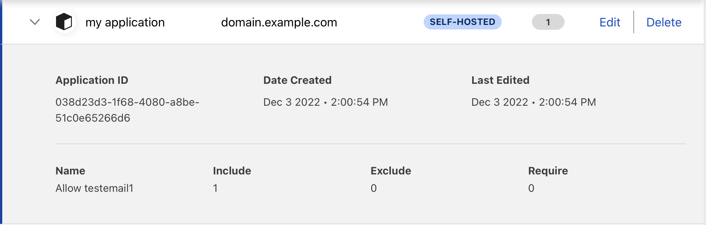

# Cloudflare Zero-Trust Operator

This is very early alpha project and not finalized yet & is therefore still a work in progess. 
Expect breaking changes

Cloudflare Zero-Trust operator allow you to manage your zero-trust configuration directly from kubernetes

<!-- Version_Placeholder -->

[](https://doc.crds.dev/github.com/BojanZelic/cloudflare-zero-trust-operator)

[](https://goreportcard.com/report/github.com/bojanzelic/cloudflare-zero-trust-operator)
[](https://pkg.go.dev/github.com/bojanzelic/cloudflare-zero-trust-operator)
[](https://codecov.io/gh/BojanZelic/cloudflare-zero-trust-operator)

## Example Usage

Cloudflare Access Group
```yaml
apiVersion: cloudflare.zelic.io/v1alpha1
kind: CloudflareAccessGroup
metadata:
  name: accessgroup-example
spec:
  name: my access group
  include:
    - emails:
      - testemail1@domain.com
      - testemail2@domain.com
```

```yaml
apiVersion: cloudflare.zelic.io/v1alpha1
kind: CloudflareAccessApplication
metadata:
  name: domain-example
spec:
  name: my application
  domain: domain.example.com
  policies: 
    - name: Allow testemail1
      decision: allow
      include:
        - emails:
          - testemail1@domain.com
```



## Features
Currently in Project scope
- [x] Manage Cloudflare Access Groups
- [x] Manage Cloudflare Access Applications
- [x] Manage Cloudflare Access Tokens

## Roadmap
- [ ] Deletion of Managed resources

## Advanced Usage

See some more examples of how to use the [cloudflare zero-trust operator here](./docs/Advanced_Usage.md) 

## Install

### Install with Helm

1) Create your namespace
```
kubectl create ns zero-trust-system
```

2) Create a secret with your cloudflare credentials

```yaml
apiVersion: v1
metadata:
  name: cloudflare-creds
  namespace: zero-trust-system
kind: Secret
type: Opaque
stringData:
  CLOUDFLARE_ACCOUNT_ID: <id>
  # Either EMAIL+KEY or TOKEN must be supplied
  # note: keys must still be defined even if they are empty
  CLOUDFLARE_API_EMAIL: <email>
  CLOUDFLARE_API_KEY: <api_key>
  CLOUDFLARE_API_TOKEN: <api_token>
```

3) Install the helm repo
```bash
helm repo add zelic-io https://zelic-io.github.io/charts
 
helm install --namespace=zero-trust-system --set secretRef=cloudflare-creds cloudflare-zero-trust-operator zelic-io/cloudflare-zero-trust-operator
```

## Install with Kustomize

`kustomize.yaml`
```yaml
apiVersion: kustomize.config.k8s.io/v1beta1
kind: Kustomization

resources:
  - https://github.com/BojanZelic/cloudflare-zero-trust-operator//config/default?ref=main

secretGenerator:
- name: cloudflare-creds
  behavior: replace
  literals:
    - CLOUDFLARE_API_KEY=""
    - CLOUDFLARE_API_EMAIL=""
    - CLOUDFLARE_ACCOUNT_ID=""
    - CLOUDFLARE_API_TOKEN=""
```

## Compatability

This provider's versions are able to install and manage the following versions of Kubernetes:

|                                                | v1.22 | v1.23 | v1.24 |
| ---------------------------------------------- | ----- | ----- | ----- |
| Cloudflare Zero Trust Operator v0.0.1-current  | ✓     | ✓     | ✓     |

## License

Copyright 2022.

Licensed under the Apache License, Version 2.0 (the "License");
you may not use this file except in compliance with the License.
You may obtain a copy of the License at

    http://www.apache.org/licenses/LICENSE-2.0

Unless required by applicable law or agreed to in writing, software
distributed under the License is distributed on an "AS IS" BASIS,
WITHOUT WARRANTIES OR CONDITIONS OF ANY KIND, either express or implied.
See the License for the specific language governing permissions and
limitations under the License.

